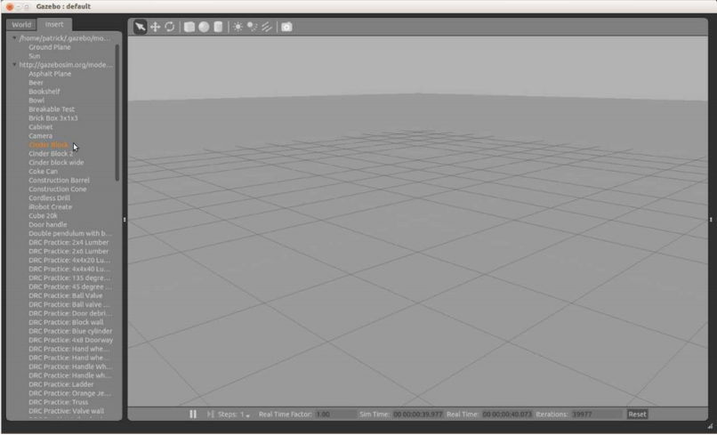

# 12.7 Пропавшая модель баг в Gazebo 1.9

Руководство пользователя объясняет, как вставлять модели в сцену. Большинство из этих моделей хранятся в онлайновой базе данных по адресу [http://gazebosim.org/models](http://gazebosim.org/models), но затем кэшируется в каталоге ~/.gazebo при первом использовании. Если мир Gazebo ссылается на модель, которая еще не доступна в вашем кэше, предполагается, что модель автоматически загрузится из онлайновой базы данных. Однако, в версии Gazebo 1.9 существует ошибка, препятствующая правильной работе. Так как эта ошибка влияет на нашу симуляцию Kobuki, нам нужно знать об обходном пути.

В следующем разделе мы расскажем о роботе Kobuki в Gazebo, а также о мире, который включает в себя коллекцию столов и несколько шлакоблоков, которые будут служить препятствиями. Таблицы составлены из материалов, которые уже существуют в медиа-файлах, которые включены в установку Gazebo. Тем не менее, блоки шлакоблоков определяются mesh файлом Collada, который находится в онлайн-базе данных по адресу [http://gazebosim.org/models](http://gazebosim.org/models). Из-за ошибки в Gazebo 1.9 этот mesh файл не будет автоматически загружен, когда мы впервые попытаемся загрузить мир Kobuki.

Чтобы обойти ошибку, мы должны вручную вставить модель в сцену \(любую сцену\) в Gazebo. После этого Gazebo загрузит модель в ваш локальный кэш, где она будет доступна любому миру, который впоследствии будет загружен.

Давайте выполним эту ручную вставку для шлакоблока сейчас, чтобы в следующем разделе у нас был доступ к нему для симуляции Kobuki. Если графический интерфейс Gazebo еще не запущен, запустите его сейчас с пустым миром: 

```text
$ gazebo
```

Когда появится окно GUI, нажмите на вкладку Insert \(Вставить\) и подождите, пока не завершится подключение к онлайн базе данных. После этого вы сможете открыть список моделей в разделе с надписью [http://gazebosim.org/models](http://gazebosim.org/models) и выбрать шлакоблок, как показано ниже:



После выбора шлакоблока переместите мышь в любое место в пустую сцену, и блок появится под курсором. Щелкните левой кнопкой мыши, чтобы поместить блок на сцену, как показано ниже:


Обратите внимание, что теперь шлакоблок также появится под кэшированными моделями, перечисленными в разделе /home/yourname/.gazebo/models на вкладке "Вставка". Это подтверждает, что модель теперь доступна локально и будет автоматически загружена в любой мир, который потребует ее позже.

